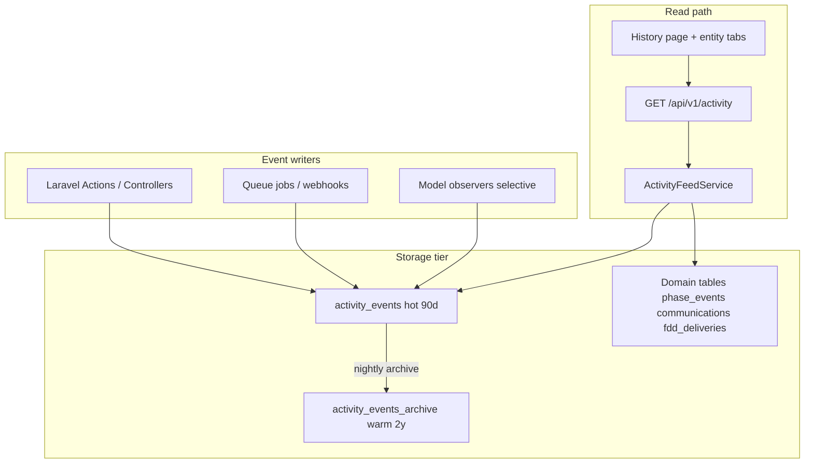

# Activity history — design plan

Last updated: 2026-06-03. Status: **Phase A–C + navigation collection** (global feed, entity timelines, business writers expanded). Page visits use **`activity_navigation`** (daily upsert, async ingest) — see [`ACTIVITY_WRITERS.md`](./ACTIVITY_WRITERS.md). Commands: `activity:archive`, `activity:purge-navigation`.

Companion: [`METADATA.md`](./METADATA.md) (Tier 2 events), [`PRODUCTION_READINESS.md`](./PRODUCTION_READINESS.md).

---

## Problem statement

Zorzees shows user activity via the WordPress **Stream** plugin (`wp_stream`), wrapped by `GG_Franchise_Stream_Api` and consumed in fl-react as:

- Dashboard “Activity history” (last 5 / 10 / 15 days for current user)
- Entity panels via `useHistory(id)` → `GET zorzees/v1/stream/activity/{object_id}`

Stream is powerful but **too heavy for FIL’s stack**:

| Stream pain point | Why it hurts |
| ----------------- | ------------ |
| Logs almost everything (ACF field blur, cron, plugin hooks) | Millions of low-value rows |
| `summary` is free-text HTML assembled at log time | Hard to filter, search, or i18n |
| Queries use `LIKE '%search%'` across summary, connector, context, action, IP | Full table scans |
| DataTables API with offset pagination | Slow on deep pages |
| Single monolithic `wp_stream` table, unbounded retention | DB bloat, backup cost |
| Tight coupling to WP hooks | Not portable to Laravel |

FIL needs **similar staff visibility** (who did what, when, on which record) with **predictable read cost** and **bounded storage**.

---

## Goals

1. **Global history page** — scrollable feed of meaningful staff/system actions (Z dashboard parity).
2. **Entity timelines** — compact activity tab on lead / store / contact detail (Z panel parity).
3. **Fast reads** — cursor pagination, indexed filters, p95 &lt; 200ms for 25-item page on VPS Postgres.
4. **Bounded writes** — log intentional business events only; batch noisy updates.
5. **Retention** — hot window in primary table; older rows archived or purged on schedule.
6. **Legacy import** — optional one-time backfill from Stream (filtered), not a runtime dependency.

## Non-goals (v1)

- Forensic-grade audit (immutable legal hold, SIEM export) — future hardening phase.
- Real-time websocket push — polling / infinite scroll is enough.
- Logging every custom field keystroke — one “Lead fields updated” event per save.
- Replicating Stream connectors 1:1 (Mailgun plugin internals, WP cron noise, etc.).

---

## Design principles

1. **Structured events at write time** — store `category`, `action`, `subject`, not parsed hook output.
2. **Denormalize for lists** — `actor_name`, `summary` precomputed; no joins required for feed rendering.
3. **Domain tables stay source of truth** — don’t duplicate FDD/comms/phase rows; **project** them in the feed.
4. **Append-only hot log** — new `activity_events` table for actions without a domain table.
5. **Archive, don’t infinite-grow** — move or delete old rows; configurable per client.

---

## Architecture overview



### Two-layer read model

| Layer | Purpose |
| ----- | ------- |
| **`activity_events`** | Canonical log for CRUD, auth, settings, imports, and anything without a domain event table. |
| **Domain projections** | Existing Tier-2 tables (`lead_phase_events`, `communications`, `fdd_deliveries`, `notification_deliveries`, `ach_transfers`, …) normalized into the same `ActivityItem` DTO at query time. |

The API returns one unified shape; the UI doesn’t care which table sourced the row.

---

## Data model

### Table: `activity_events` (hot)

```sql
-- Conceptual schema (Postgres)
CREATE TABLE activity_events (
  id              BIGSERIAL PRIMARY KEY,
  occurred_at     TIMESTAMPTZ NOT NULL DEFAULT NOW(),

  -- Who
  actor_user_id   BIGINT NULL REFERENCES users(id) ON DELETE SET NULL,
  actor_name      VARCHAR(255) NOT NULL,          -- denormalized snapshot

  -- What (controlled vocabulary)
  category        VARCHAR(32) NOT NULL,           -- lead | store | contact | fdd | comm | auth | settings | import | finance | system
  action          VARCHAR(64) NOT NULL,           -- created | updated | deleted | sent | signed | login | ...

  -- Human line for UI (max ~500 chars, plain text, no HTML)
  summary         TEXT NOT NULL,

  -- Primary subject (nullable for global events)
  subject_type    VARCHAR(32) NULL,               -- lead | store | user | ...
  subject_id      BIGINT NULL,

  -- Optional secondary link (e.g. FDD on a lead)
  object_type     VARCHAR(32) NULL,
  object_id       BIGINT NULL,

  -- Traceability
  source          VARCHAR(32) NOT NULL DEFAULT 'app',  -- app | webhook | scheduler | import | legacy_stream
  request_id      UUID NULL,                      -- optional correlation id
  payload         JSONB NULL,                     -- small structured diff only; no blobs

  -- Import lineage
  legacy_stream_id BIGINT NULL UNIQUE
);

CREATE INDEX activity_events_occurred_at_idx ON activity_events (occurred_at DESC);
CREATE INDEX activity_events_actor_idx ON activity_events (actor_user_id, occurred_at DESC);
CREATE INDEX activity_events_subject_idx ON activity_events (subject_type, subject_id, occurred_at DESC);
CREATE INDEX activity_events_category_idx ON activity_events (category, occurred_at DESC);

-- Optional: full-text search (only if search is required in v1)
-- CREATE INDEX activity_events_summary_fts ON activity_events USING GIN (to_tsvector('english', summary));
```

**Row size target:** &lt; 1 KB average (summary + small payload). No full email bodies, PDFs, or form dumps.

### Table: `activity_events_archive`

Same columns as hot table (or partitioned parent). Rows moved here after retention window. Read-only from UI unless user explicitly selects “older than 90 days” (admin only).

### Controlled vocabulary

Config file `config/fil-activity.php`:

```php
'categories' => ['lead', 'store', 'contact', 'fdd', 'comm', 'auth', 'settings', 'import', 'finance', 'system'],
'actions' => ['created', 'updated', 'deleted', 'transitioned', 'sent', 'signed', 'delivered', 'failed', 'login', 'logout', 'imported', 'calculated', 'triggered'],
```

Validators reject unknown category/action pairs at write time.

---

## What to log (and what to skip)

### Log (high signal)

| Event | Category | Action | Writer hook |
| ----- | -------- | ------ | ----------- |
| Staff login / logout | auth | login / logout | `SessionController` |
| Lead create / update / convert | lead | created / updated | `CreateLead`, `UpdateLead`, `ConvertLeadToStore` |
| Store create / update | store | created / updated | `CreateStore`, `UpdateStore` |
| Pipeline transition | lead | transitioned | *project from* `lead_phase_events` (or dual-write ref) |
| FDD send / sign / resend | fdd | sent / signed | *project from* `fdd_deliveries` |
| Email / SMS sent | comm | sent | *project from* `communications` |
| Notification rule change | settings | updated | `NotificationRuleController` |
| Field schema change | settings | updated | `FieldController` |
| Legacy import run | import | imported | `LegacyImportCommand` |
| Royalty calculate / ACH trigger | finance | calculated / triggered | store royalty actions |
| Failed outbound (bounced email) | comm | failed | Mailgun webhook |

### Skip (low signal — Stream’s main bloat)

- Empty or hidden ACF field updates (Z already filters these)
- WP cron, plugin updates, transients
- Read-only API calls (`GET` grid queries)
- Per-keystroke field edits → **one** “Lead updated (3 fields)” per save
- Health checks, `GET /api/health`
- AI chat token streams

### Batching rule

When `UpdateLead` changes multiple columns + custom fields in one request → **one** `activity_events` row with `payload.changed_keys: ['title','lead_status','referral_notes']`.

---

## Read API

### Endpoints

| Method | Path | Purpose |
| ------ | ---- | ------- |
| `GET` | `/api/v1/activity` | Global feed (cursor paginated) |
| `GET` | `/api/v1/activity/subjects/{type}/{id}` | Entity timeline |

### Query params (global feed)

| Param | Type | Default | Notes |
| ----- | ---- | ------- | ----- |
| `cursor` | string | — | Opaque, base64-encoded `(occurred_at, id)` |
| `limit` | int | 25 | Max 50 |
| `days` | int | 30 | 7, 30, 90 presets (replaces Z’s 5/10/15) |
| `actor_user_id` | int | — | Filter by staff user |
| `category` | string | — | Optional facet |
| `subject_type` | string | — | Optional facet |
| `q` | string | — | **Phase 2:** FTS only; omit in v1 if not needed |

### Response shape

```json
{
  "data": [
    {
      "id": "evt_12345",
      "occurred_at": "2026-05-30T14:22:00Z",
      "actor": { "id": 7, "name": "Jane Doe" },
      "category": "lead",
      "action": "updated",
      "summary": "Jane Doe updated lead \"Smith Application\" (status, source)",
      "subject": { "type": "lead", "id": 42, "label": "Smith Application", "path": "/reports/leads/42" },
      "source": "app"
    }
  ],
  "meta": {
    "next_cursor": "…",
    "has_more": true
  }
}
```

**ID strategy:** Prefix domain-projected rows (`phase_12`, `comm_88`, `fdd_5`) vs native (`evt_12345`) so cursors stay stable.

### `ActivityFeedService` algorithm

1. Parse filters + cursor.
2. If **entity timeline**: parallel limited queries:
   - `activity_events` WHERE subject = entity ORDER BY occurred_at DESC LIMIT n
   - `lead_phase_events` / `communications` / `fdd_deliveries` as applicable
3. Merge-sort by `occurred_at`, take `limit`, encode next cursor.
4. If **global feed**: query `activity_events` only in v1 (fast path). Phase 2: include projected comms/FDD in global feed if product wants it.

**Performance guard:** never `UNION ALL` unbounded tables without per-source `LIMIT`. Use “top N from each source, then merge” pattern.

---

## Write path

### `ActivityRecorder` service

```php
ActivityRecorder::record(
    category: 'lead',
    action: 'updated',
    summary: 'Jane Doe updated lead "Smith Application"',
    subject: $lead,
    actor: $request->user(),
    payload: ['changed_keys' => ['title', 'lead_status']],
);
```

- Runs **after** successful DB commit (listener on domain events or explicit call in Actions).
- Queue optional for high-volume imports (bulk write buffered inserts).
- Uses `actor_name` snapshot so renamed users don’t rewrite history.

### Integration points (implementation order)

1. `SessionController` — login/logout
2. `UpdateLead`, `UpdateStore`, `CreateStore`
3. Settings admins (notification rules, fields, drips)
4. `LegacyImportCommand` completion summary
5. Model observers **only** where Actions don’t exist (avoid double logging)

Existing `LeadPhaseChanged` event → listener can write to `activity_events` **or** rely on projection only (prefer projection to avoid duplicate lines).

---

## Retention & archival

Config `config/fil-activity.php`:

```php
'retention' => [
    'hot_days' => 90,        // UI default window
    'archive_days' => 730,   // keep in archive table
    'purge_after_days' => 730, // delete archive rows (null = keep forever)
],
```

### Nightly command: `activity:archive`

1. `INSERT INTO activity_events_archive SELECT * FROM activity_events WHERE occurred_at < now() - hot_days`
2. `DELETE FROM activity_events WHERE occurred_at < now() - hot_days`
3. Optional: `DELETE FROM activity_events_archive WHERE occurred_at < now() - purge_after_days`
4. `VACUUM ANALYZE activity_events` (Postgres maintenance)

Run via Laravel scheduler. Log counts to `activity_events` (meta).

### Storage estimate (single client)

| Volume | Rows/month | Hot table (~90d) |
| ------ | ---------- | ---------------- |
| Small | ~5k | ~15k rows ≈ 15 MB |
| Medium | ~50k | ~150k rows ≈ 150 MB |
| Large | ~500k | ~1.5M rows → **must** enforce skip rules + batching |

Compare to Stream: often **10–50×** more rows due to ACF noise.

---

## Legacy Stream import (optional)

Command: `legacy:import-stream --days=365 --execute`

1. Read `wp_stream` (or export) for `blog_id` matching client.
2. Apply Z’s exclusion rules (`exclude_inconsistent_stream_logs` logic): skip empty ACF, hidden fields, noisy connectors.
3. Map connector/context/action → FIL `category`/`action` where possible; else `category=system`.
4. Strip HTML from summary → plain text.
5. Insert into `activity_events_archive` with `source=legacy_stream`, `legacy_stream_id` for dedup.
6. Report: imported / skipped / unmapped.

**Do not** import full Stream history by default — default **90 days** for parity, extend on request.

---

## UI plan

### 1. Global History page (`/history`)

Sidebar: between Dashboard and Documents (or under Dashboard section).

- Virtualized infinite list (react-window or `@tanstack/react-virtual`) — not DataTables.
- Sticky filters: period (7 / 30 / 90 days), category chips, actor dropdown.
- Each row: relative time, actor avatar/initials, summary (linkified subject).
- Permission: `activity.view` (new) or reuse `reports.view` for franchisor roles.

### 2. Dashboard widget (HomePage)

Replace placeholder “Latest activity” with last **10** items from global feed (same API, `limit=10`). Link to `/history`.

### 3. Entity timeline tab

Lead / store / contact detail → **Activity** card:

- Uses `/api/v1/activity/subjects/{type}/{id}`
- Shows merged domain + activity_events
- Max height scroll, “View all” → global feed pre-filtered

### UX vs Z

| Z (Stream) | FIL |
| ---------- | --- |
| 5/10/15 day toggle | 7/30/90 day (configurable) |
| HTML in summaries | Plain text + links |
| Fixed 280px list, no virtualization | Virtualized, cursor load |
| Per-user dashboard only | Global + per-entity + actor filter |
| Entity history via object_id in Stream | Typed subject + domain projections |

---

## Security & permissions

| Permission | Who |
| ---------- | --- |
| `activity.view` | franchisor, admin (default) |
| `activity.view_own` | optional: lead_owner sees only self + own leads’ events |

Payload must **never** contain passwords, tokens, full PII dumps, or email bodies. Link to comm record instead.

IP address: omit in v1 (Stream logged IP; rarely used in UI). Add `actor_ip` column later if compliance requires.

---

## Implementation status

### Phases A–C — complete

- Migrations: `activity_events`, `activity_events_archive`
- `ActivityRecorder`, `ActivityFeedService`, cursor pagination
- `GET /api/v1/activity` + subject timelines + domain projectors
- `/history` page, dashboard widget, entity Activity tabs
- `activity:archive` + scheduler; permission `activity.view`
- CSV export: `GET /api/v1/activity/export`

### Phase D — Legacy import (optional, not implemented)

Command: `legacy:import-stream --days=365 --execute`

1. Read `wp_stream` for client `blog_id`.
2. Apply Z noise filters (skip empty ACF, hidden fields, noisy connectors).
3. Map connector/context/action → FIL `category`/`action`; strip HTML summaries.
4. Insert into `activity_events_archive` with `source=legacy_stream`.
5. Default **90 days** for go-live parity.

See [LEGACY_IMPORT_DRY_RUN.md](./LEGACY_IMPORT_DRY_RUN.md).

### Phase E — Polish (ongoing)

- [ ] FTS search on summary (if staff request)
- [ ] Metrics: events/day, archive size, slow query log

---

## Success metrics

| Metric | Target |
| ------ | ------ |
| Global feed p95 latency | &lt; 200 ms @ 25 rows |
| Entity timeline p95 | &lt; 100 ms @ 30 rows |
| Hot table row count @ 90d | &lt; 200k for typical client |
| Events per lead save | 1 (not N fields) |
| Staff satisfaction | “I can see who changed what” without opening WP |

---

## References

- Z Stream API: `grabba-franchise/api/class-franchise-stream-api.php`
- Z Stream filters: `grabba-franchise/admin/class-franchise-admin-stream.php`
- fl-react dashboard: `fl-react/.../pages/Dashboard.tsx` (`useActivityStream`)
- fl-react entity history: `fl-react/.../hooks/API/useWPApi.ts` (`useHistory`)
- FIL Tier 2 events: `docs/METADATA.md`
- FIL existing tables: `lead_phase_events`, `communications`, `fdd_deliveries`, `notification_deliveries`
