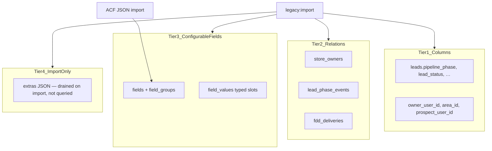

# FIL metadata model

Legacy CRM systems often store almost everything in untyped key/value meta tables: one row per key, duplicate keys, no FK integrity, and poor indexability for filters. **FIL does not copy that pattern.**

## Design principles

1. **If you filter, sort, aggregate, or join on it → first-class column or FK** — not a meta key.
2. **If it is a relationship → pivot or child table** — not serialized IDs in meta.
3. **If it is configurable per client → `fields` schema + typed `field_values`** — not arbitrary postmeta rows.
4. **If it is audit/history → event/log tables** — not hidden meta mutations.
5. **`legacy_*` IDs only for import lineage** — never used at runtime.

## Four storage tiers



### Tier 1 — Entity columns (hot data)

Native PostgreSQL columns on entity tables. Used for grids, aggregations, pipeline logic, and API responses.

**Leads (`leads`)** — examples:

| Column | Legacy meta key | Notes |
| ------ | ----------------- | ----- |
| `pipeline_phase` | (derived from pipeline plugin) | tinyint, indexed |
| `lead_status` | `lead_status` | select value |
| `lead_stage` | `lead_stage` | select value |
| `lead_fdd_status` | `lead_fdd_status` | sidebar “status” aggregations in legacy UI |
| `lead_temp` | `lead_temp` | temperature |
| `lead_source` | `lead_source` | source |
| `likelihood_to_close` | `likelihood_to_close` | numeric |
| `owner_user_id` | `lead_owner` | **FK to users**, not display name string |
| `prospect_user_id` | prospect link | FK |
| `area_id`, `organization_id` | tax/relations | FK |
| `disclosed_at`, `nda_signed_at`, … | date fields | timestamps |

**Stores, areas, users** — same rule: `store_status`, `approval_status`, `spa_id`, `pos_provider`, etc. are columns.

### Tier 2 — Relations & domain tables

| Pattern | FIL table | Not |
| ------- | --------- | --- |
| Store ownership | `store_owners` | repeater meta |
| Phase history | `lead_phase_events` | ad-hoc meta updates |
| FDD delivery | `fdd_deliveries` | post meta blob |
| Royalties | `royalty_periods`, `royalty_line_items` | weekly_store_* as opaque meta |
| ACH | `ach_customers`, `ach_funding_sources`, `ach_transfers` | user/store meta |
| Comms | `communications` | z_communications + meta |

### Tier 3 — Configurable fields (ACF replacement)

Schema-driven custom fields for long-tail / client-specific data.

**`field_groups`** — UI grouping (imported from ACF JSON).  
**`fields`** — definition: type, choices, validation, role visibility, **and where values live**:

| `storage` | Meaning |
| --------- | ------- |
| `column` | Value on entity table (`maps_to_column`) |
| `foreign_key` | Value is `*_id` on entity table |
| `field_value` | Value in `field_values` (default for true custom fields) |
| `relation` | Separate child table (repeaters, multi-select entities) |

**`field_values`** — one row per entity + field, **typed slots** (not stringly-typed EAV):

| Column | Used when `fields.type` is |
| ------ | -------------------------- |
| `value_text` | text, textarea, select, email, url |
| `value_number` | number, range |
| `value_boolean` | true_false |
| `value_date` | date |
| `value_datetime` | date_time |
| `value_json` | repeater, group, gallery (structured only) |

Unique on `(entity_type, entity_id, field_id)`.

Import command promotes ACF fields marked for grid columns or used in aggregations to **Tier 1** automatically (`storage=column`).

### Tier 4 — Import staging only

- `extras` JSON on entities — holds unmigrated keys during `legacy:import`; import report lists keys still in `extras`; goal is **empty extras** after parity pass.
- Never query `extras` in application code, grids, or aggregations.

## API shape vs storage

The grid/query API may still expose an ES-compatible **`meta.lead_status`** aggregation key for UI parity. That is a **response adapter** — storage remains `leads.lead_fdd_status` or `leads.lead_status`, not generic meta tables.

Detail API returns structured objects:

```json
{
  "id": 42,
  "title": "Smith Application",
  "pipeline_phase": 3,
  "lead_status": "6",
  "owner": { "id": 7, "name": "Jane Doe" },
  "custom": {
    "referral_notes": "Met at expo",
    "preferred_markets": ["Denver", "Boulder"]
  }
}
```

`custom` is built from `field_values` + schema — not a flat bag of 200 meta keys.

## ACF import rules (`legacy:import-acf-fields`)

1. Parse bundled or configured ACF JSON (`resources/legacy-acf/*.json`).
2. Skip UI-only types: `tab`, `message`, `accordion`.
3. For each field, set `entity` from location rules (`application` → `lead`, `store` → `store`, …).
4. Classify storage:
   - In grid default columns or aggregation list → `storage=column`, create/migrate column if missing.
   - User/post reference → `storage=foreign_key`.
   - Repeater/group → `storage=relation` or `value_json` with documented shape.
   - Else → `storage=field_value`.
5. Copy choices into `fields.config` for selects.

## What we explicitly avoid

| Legacy EAV anti-pattern | FIL approach |
| ----------------------- | ------------ |
| `(entity_id, meta_key, meta_value)` rows | typed columns + `field_values` |
| `lead_owner` as display name string | `owner_user_id` FK |
| Serialized PHP arrays in meta | JSONB in `value_json` with schema |
| Duplicate keys / revision meta | unique constraints |
| ElasticPress to make meta queryable | indexes on real columns |
| `form_data` blob on lead | `field_values` + tier-1 columns |

## Migration checklist (per entity)

- [ ] Inventory top meta keys from dump (`legacy:inventory`)
- [ ] Promote top 20 keys by frequency to columns
- [ ] Map relationships to FKs / pivots
- [ ] Import ACF schema to `fields`
- [ ] Import values to columns + `field_values`
- [ ] Remaining keys → `extras` with report
- [ ] Parity test: grid filters + aggregations match legacy counts

See also `docs/schema-mapping.md` and `docs/SEARCH.md`.
