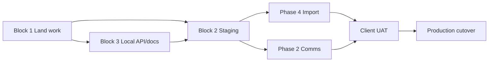

# Next session — execution plan

**Created:** 2026-05-31  
**Branch:** `dev` (large uncommitted diff — land first)  
**North star:** [PRODUCTION_READINESS.md](./PRODUCTION_READINESS.md) (~62% → staging cutover)

---

## Chat starter (paste into a new chat)

```
Work through @docs/NEXT_SESSION.md in order. Start with Block 1 (commit/verify uncommitted work on dev), then proceed based on whether Forge access is available. Do not expand MVP scope. Run verification after each block.
```

---

## Context — what’s already done

Phase **1 Staff UX exit criteria are met**. Local Postgres is the default; legacy import has been run locally (~570 leads, ~7.5k users).

| Area | Status |
|------|--------|
| Staff SPA (grids, details, auth, slide-over) | Shipped |
| FDD single + bulk from leads grid | Shipped |
| SMS/email composer + queued send | Shipped |
| Activity timeline (lead + contact) | Shipped |
| Closing workflow (status + fee lines) | Shipped |
| Contact custom fields (P-026) | Shipped |
| PostgreSQL local + Docker + legacy import | Shipped (uncommitted) |
| Empty states (`EntityLoadState`, `AsyncSection`) | Shipped (uncommitted) |
| OpenAPI audit (`openapi:audit`, 113/113 routes) | Shipped (uncommitted) |
| Pint + ESLint + CI gates | Shipped (uncommitted) |
| Accessibility (`ModalDialog`, focus trap, grid/login ARIA) | Shipped (uncommitted) |
| Backend tests | **294 Pest** passing |
| Frontend tests | **50 Vitest** passing |
| SEC-001–025 code fixes | Shipped — [SECURITY_AUDIT.md](./SECURITY_AUDIT.md) |

### Production exit checklist (2 / 7)

| # | Gate | Status |
|---|------|--------|
| 1 | Staging VPS; `mvp:staging-check` green | ☐ |
| 2 | Phase 1 staff UX | ☑ |
| 3 | Mailgun domain verified | ☐ |
| 4 | Queue worker + failed-job monitoring | ☐ |
| 5 | Demo credentials rotated on staging/prod | ☐ |
| 6 | DB backup restore tested | ☐ |
| 7 | Runbook documented | ☑ |

---

## Uncommitted work on `dev` (land in Block 1)

Rough groups for commits (adjust if cleaner):

1. **Postgres + seeders** — `config/database.php`, `.env` docs, `DatabaseSeeder`, `DemoSeeder`, `LOCAL_DEV.md`
2. **Quality pass** — empty states, OpenAPI audit command + `docs/api.openapi.yaml`, Pint/ESLint/CI
3. **Accessibility** — `ModalDialog`, `useDialogA11y`, modal refactors, `FilGrid`/`LoginPage`/`FormField`
4. **Built assets** — `npm run build` output under `backend/public/fil-assets/`

**Do not commit** `.env` secrets or client dumps.

---

## Block 1 — Land & verify (do first)

### Tasks

- [ ] Review `git diff`; split into 2–4 logical commits on `dev` (or `feature/consolidate-quality-pass` → merge)
- [ ] Full verification:

```bash
docker compose up -d postgres   # if not running

cd backend
unset DB_CONNECTION DB_DATABASE DB_HOST DB_PORT DB_USERNAME DB_PASSWORD
composer pint:test
php artisan test --compact
php artisan openapi:audit --fail-on-drift
php artisan mvp:staging-check

cd ../frontend
npm run lint && npm run test:run && npm run build

cd ../frontend/widget
npm run build
```

- [ ] Update doc counts in `PRODUCTION_READINESS.md` and `NEXT_LOCAL_WORK.md` (294 Pest, 50 Vitest, a11y ☑)
- [ ] If remote configured: open PR `dev` → `staging` when ready

### Done when

All tests/lint/build green; uncommitted quality-pass work is committed; docs reflect current counts.

---

## Block 2 — Phase 0 staging ship (if Forge access)

**Runbook:** [MVP_DEPLOY.md](./MVP_DEPLOY.md) · **Deploy script:** `scripts/forge-deploy.sh`

| Step | Task | Verify |
|------|------|--------|
| 2.1 | Provision Forge site (PHP 8.4, Nginx, Postgres 17) | HTTPS loads |
| 2.2 | Configure `.env` (see MVP_DEPLOY secrets table) | `APP_KEY`, `DB_*`, `SANCTUM_STATEFUL_DOMAINS` |
| 2.3 | Wire `scripts/forge-deploy.sh` in Forge deployment | Deploy succeeds |
| 2.4 | Queue worker + scheduler cron | Jobs process |
| 2.5 | `migrate --force` — **no DemoSeeder in production** | Admin only |
| 2.6 | Manual smoke | Login → leads grid → lead detail → FDD modal → composer |
| 2.7 | `php artisan mvp:staging-check` on staging | All green |
| 2.8 | Rotate/remove demo `password` accounts | No demo creds |

### Done when

Staging URL passes smoke + `mvp:staging-check`; demo users removed.

**If Forge is blocked:** skip to Block 3.

---

## Block 3 — Primary engineering (pick one)

### Option A — Audit log export API (recommended if local-only)

**Effort:** ~1 day · **Phase:** 6.5 · **Branch:** `feature/activity-export-api`

- [ ] `GET /api/v1/activity/export` — CSV (+ optional JSON query param)
- [ ] Same auth/scope as `GET /api/v1/activity` (staff-only, franchise scope)
- [ ] OpenAPI entry in `docs/api.openapi.yaml`
- [ ] Pest feature tests (admin, scoped user, forbidden)
- [ ] Optional: History page button “Export (server)” alongside client-side CSV

**Reference:** existing activity controller/service, client-side export on History page.

### Option B — Phase 4 client import on staging (after Block 2)

**Branch:** `feature/staging-import`

- [ ] Obtain latest client dump (`data/local.sql.gz` or client-provided)
- [ ] Follow [LEGACY_IMPORT_DRY_RUN.md](./LEGACY_IMPORT_DRY_RUN.md)
- [ ] `legacy:import --execute` on staging Postgres
- [ ] `legacy:parity-report` — document acceptable deltas
- [ ] Spot-check 10 leads + 5 stores in staging UI
- [ ] Log mapping gaps in [schema-mapping.md](./schema-mapping.md)

### Option C — Dependency audit CI (~half day)

**Branch:** `feature/dependency-audit-ci`

- [ ] CI fails on high/critical `composer audit` / `npm audit`
- [ ] Document allowlist process in CI comments or short doc section

### Option D — Compliance docs only (~half day)

- [ ] `docs/SECRETS_ROTATION.md`
- [ ] PII retention draft (Phase 6.4)

---

## Block 4 — End of session

- [ ] Tests green on branch merged to `dev`
- [ ] Staging smoke noted (URL + checklist results) if Block 2 ran
- [ ] Update this file: mark completed blocks, note blockers
- [ ] Update [NEXT_LOCAL_WORK.md](./NEXT_LOCAL_WORK.md) queue

---

## Do not start (unless client asks)

- New MVP features beyond parity checklist
- Dwolla/Plaid live ACH (Phase 3 stubs only)
- Redis / Elasticsearch
- Pest refactors unrelated to failing tests
- Forge env work without VPS credentials

---

## Key paths

| Area | Path |
|------|------|
| Roadmap | `docs/PRODUCTION_READINESS.md` |
| Local dev | `docs/LOCAL_DEV.md` |
| Deploy | `docs/MVP_DEPLOY.md` |
| OpenAPI | `docs/api.openapi.yaml`, `php artisan openapi:audit` |
| A11y (new) | `frontend/src/components/ui/ModalDialog.tsx`, `frontend/src/lib/a11y/` |
| Import | `php artisan legacy:import`, `legacy:parity-report` |
| Staging check | `php artisan mvp:staging-check` |

## Local credentials (dev only)

- Admin: `admin@fil.test` / `password`
- Postgres (Docker): `fil` / `fil` / `fil` on `:5432`
- **Unset** `DB_CONNECTION=sqlite` in shell before artisan commands if exported for E2E

---

## Final plan (30-day arc)



1. **Week 1** — Phase 0 staging (Block 2)
2. **Week 2** — Phase 4 import + Phase 2 Mailgun
3. **Week 3** — Sentry, E2E smoke, security docs
4. **Week 4** — Client UAT, backup drill, prod deploy

---

## Related docs

- [NEXT_LOCAL_WORK.md](./NEXT_LOCAL_WORK.md) — ongoing local queue
- [MVP_STATUS.md](./MVP_STATUS.md) — what ships today
- [parity-checklist.md](./parity-checklist.md) — legacy parity IDs
- [PEST_REVIEW.md](./PEST_REVIEW.md) — Pest 4 conventions
