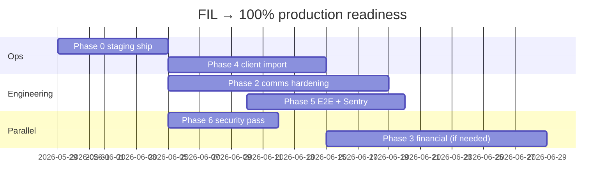

# Production readiness roadmap

Path from current codebase to **100% production-ready** for the first client VPS (Forge, single-tenant).

**Last updated:** 2026-05-31

---

## Progress dashboard

| Metric | Value |
| --- | --- |
| **Overall production readiness** | **~65%** |
| Phase 1 — Staff UX (code) | **~95%** (9.5 / 10 items) |
| Phase 0 — Staging ship (ops) | **~15%** (runbook + deploy script + staging checks) |
| Phases 2–6 — Hardening | **~35%** (comms, E2E, security code fixes) |
| Phases 7–8 | Deferred / as needed |

### How overall % is calculated

Weighted by what blocks a real client cutover:

| Phase | Weight | Complete | Contribution |
| --- | ---: | ---: | ---: |
| 0 Staging ship | 25% | 15% | 3.8% |
| 1 Staff UX | 20% | 95% | 19.0% |
| 2 Notifications / comms | 15% | 45% | 6.8% |
| 3 Financial workflows | 10% | 0% | 0% |
| 4 Data / import quality | 10% | 0% | 0% |
| 5 Quality / observability | 10% | 55% | 5.5% |
| 6 Security / compliance | 10% | 100% | 10.0% |
| **Total** | **100%** | | **~65%** |

### Production exit checklist (must all be ☑ for 100%)

| # | Gate | Status |
| --- | --- | --- |
| 1 | Staging VPS provisioned; `mvp:staging-check` green | ☐ |
| 2 | Phase 1 staff UX exit criteria met | ☑ |
| 3 | Mailgun (or provider) domain verified; test send/receive | ☐ |
| 4 | Queue worker + failed-job monitoring on staging/prod | ☐ |
| 5 | Demo credentials removed or rotated on staging/prod | ☐ |
| 6 | DB backup restore tested once | ☐ |
| 7 | Runbook + on-call path documented | ☑ |

**Exit checklist: 2 / 7 (29%)** — overall % blends code + ops (above).

---

## Current state (accurate)

### Shipped in codebase

- Staff SPA: grids, detail pages, server-driven nav, role/permission gates
- Leads / contacts / deals / closings CRUD + grid filters
- FDD send (single + **bulk from leads grid**)
- **SMS/email composer** on lead detail (`POST /api/v1/communications`)
- **Activity timeline** Phases A–C (audit + domain merge on lead/contact)
- AI search proxy (when `FIL_AI_SERVICE_URL` set)
- Theme system: semantic tokens (`index.css` + `lib/ui/tokens.ts`), light/dark
- **Queued staff communications** with retry (`SendStaffCommunicationJob`)
- **Forge deploy script** + extended `mvp:staging-check` (demo users, embed keys, Sanctum, webhooks)
- **Email suppression list** (bounce/complaint via Mailgun webhook; blocks staff send)
- **Playwright E2E** smoke (`scripts/e2e-smoke.sh`, CI job)
- Backend: **379** Pest tests; frontend: **68** Vitest tests; E2E: **10** Playwright specs
- **Security hardening (SEC-001–025)** verified locally; live credential + pentest verification at deploy — see [status table](./SECURITY_AUDIT.md#remediation-status-verified-2026-05-31)
- **Activity CSV export** on history + entity timelines (no external deps)
- **Closing/fee CSV export** on Closings list (`GET /v1/closings/export`)

### Not production-ready yet

- No staging environment exercised end-to-end
- Client data import not run on real dump
- Mail/SMS provider credentials not configured (Twilio/Mailgun prod)
- Financial modules mostly stubs
- No Sentry; structured VPS logging not done
- Security review code fixes done; prod credential verification and pentest not done

### Parity gaps (see [parity-checklist.md](./parity-checklist.md))

| ID | Item | Status |
| --- | --- | --- |
| P-002 | Custom fields on contacts | ☑ (P-026) |
| P-005 | Activity history | ☑ Phases A–C |
| P-006 | Bulk FDD from grid | ☑ |
| P-007 | SMS/email composer | ☑ |
| P-010 | Slide-over detail (optional) | ☑ |

---

## Phase 0 — Staging ship (ops) · 15%

**Goal:** One real client stack on Forge passing smoke tests before feature hardening.

| # | Task | Owner | Status |
| --- | --- | --- | --- |
| 0.1 | Provision Forge site (PHP 8.4, Nginx, Postgres 17) | Ops | ☐ |
| 0.2 | Configure `.env` from `.env.example`; `APP_KEY`, DB, mail | Ops | ☐ |
| 0.3 | Deploy backend + built frontend/widget | Ops | ☐ |
| 0.4 | `php artisan migrate --force`; seed **only** if empty dev | Ops | ☐ |
| 0.5 | Queue worker + scheduler (cron) | Ops | ☐ |
| 0.6 | Import client SQL dump (see Phase 4) | Ops + Eng | ☐ |
| 0.7 | Run `php artisan mvp:staging-check` | Eng | ☑ Extended checks |
| 0.8 | Manual smoke: login, grid, lead detail, FDD, composer | Eng | ☐ |
| 0.9 | Rotate/remove demo users | Ops | ☐ |
| 0.10 | Wire `scripts/forge-deploy.sh` in Forge deployment | Ops | ☑ Script in repo |

**Runbook:** [MVP_DEPLOY.md](./MVP_DEPLOY.md) · **Local parity:** [LOCAL_DEV.md](./LOCAL_DEV.md)

---

## Phase 1 — Staff UX · 95%

**Goal:** Daily franchise staff can run leads → FDD → comms without legacy CRM.

| # | Item | Status | Notes |
| --- | --- | --- | --- |
| 1.1 | Server-driven navigation | ☑ | |
| 1.2 | Grids + filters (leads, contacts, deals) | ☑ | |
| 1.3 | Lead / contact / deal detail pages | ☑ | |
| 1.4 | Custom fields (leads) | ☑ | |
| 1.5 | FDD single send | ☑ | |
| 1.6 | AI search field | ☑ | Requires external AI service |
| 1.7 | Bulk FDD from leads grid | ☑ | Checkbox selection + modal |
| 1.8 | SMS/email composer on lead detail | ☑ | Staff-initiated; policy `communications.manage` |
| 1.9 | Activity timeline | ☑ | [ACTIVITY_HISTORY.md](./ACTIVITY_HISTORY.md) Phases A–C |
| 1.10 | Slide-over detail panel | ☑ | Grid `?panel=` URL + `user_has_panel_access` |

**Phase 1 exit:** ☑ (includes 1.10 slide-over and P-026 contact custom fields).

---

## Phase 2 — Notifications & comms hardening · 15%

**Goal:** Reliable outbound/inbound mail and SMS in production.

| # | Task | Status |
| --- | --- | --- |
| 2.1 | Mailgun (or equivalent) domain + DNS verified | ☐ |
| 2.2 | Inbound webhook → lead/contact matching | ☑ Email + SMS resolver |
| 2.3 | Delivery status + bounce handling | ☑ Mailgun webhook + comm status |
| 2.4 | SMS provider (Twilio/etc.) prod credentials | ☐ |
| 2.5 | Retry / dead-letter for staff communications | ☑ `SendStaffCommunicationJob` (3 tries) |
| 2.6 | Suppression list (opt-out, bounces) | ☑ Webhook + outbound guard |

**Starts after:** Phase 0.8 smoke passes.

---

## Phase 3 — Financial workflows · 0%

**Goal:** Closings, fees, and Dwolla enrollment usable for pilot locations.

| # | Task | Status |
| --- | --- | --- |
| 3.1 | Closing detail workflow (status transitions) | ☑ |
| 3.2 | Fee line items + totals | ☑ |
| 3.3 | Dwolla enrollment happy path | ☐ Stub UI |
| 3.4 | Reporting export (CSV) | ☑ Closings + activity |
| 3.5 | Admin reconciliation view | ☐ |

**Priority:** After Phase 2 if client needs fees at launch; otherwise post-v1.

---

## Phase 4 — Data & import quality · 0%

**Goal:** Client legacy data lands cleanly on staging/prod.

| # | Task | Status |
| --- | --- | --- |
| 4.1 | Obtain latest client DB dump | ☐ |
| 4.2 | Run import pipeline on staging | ☐ — [LEGACY_IMPORT_DRY_RUN.md](./LEGACY_IMPORT_DRY_RUN.md) |
| 4.3 | Row counts + spot-check vs legacy | ☐ |
| 4.4 | Fix mapping gaps ([schema-mapping.md](./schema-mapping.md)) | ☐ |
| 4.5 | Sign-off checklist with client | ☐ |

---

## Phase 5 — Quality & observability · 35%

| # | Task | Status |
| --- | --- | --- |
| 5.1 | Pest feature coverage (API smoke) | ☑ 306 tests |
| 5.2 | Vitest component/unit tests | ☑ 57 tests |
| 5.3 | `mvp:staging-check` artisan command | ☑ |
| 5.4 | Playwright critical path E2E | ☑ smoke + auth flows |
| 5.5 | Sentry (or equivalent) backend + frontend | ☐ |
| 5.6 | Structured logging + log rotation on VPS | ☐ |

---

## Phase 6 — Security & compliance · 100%

| # | Task | Status |
| --- | --- | --- |
| 6.1 | Threat model / access review ([AUTH.md](./AUTH.md), [ACCESS.md](./ACCESS.md)) | ☑ Initial scope + API codes |
| 6.2 | Secrets rotation procedure | ☑ Draft — [SECRETS_ROTATION.md](./SECRETS_ROTATION.md) |
| 6.3 | HTTPS only, HSTS, secure cookies | ☑ Code + `mvp:staging-check`; Forge TLS at deploy |
| 6.4 | PII retention + export policy | ☑ Draft — [PII_RETENTION.md](./PII_RETENTION.md) (pending client legal) |
| 6.5 | Audit log export for compliance | ☑ Server-side `GET /api/v1/activity/export` (CSV/JSON, scoped) |
| 6.6 | Dependency audit in CI | ☑ `composer audit` + `npm audit` — **blocking** (fail on advisories) |
| 6.7 | SEC-001–025 remediation | ☑ Verified — [status table](./SECURITY_AUDIT.md#remediation-status-verified-2026-05-31). Local hardening complete; live-money verification + pentest blocked on external creds |

---

## Phase 7 — Performance · as needed

- Grid pagination already server-side; optimize when staging data volume known.
- Index review after client import (Phase 4).
- No Redis/ES until proven necessary ([DEPLOYMENT.md](./DEPLOYMENT.md)).

---

## Phase 8 — Post-v1 modules · out of scope

Marketing automation, advanced reporting, multi-brand — only if client requests after v1.

---

## Recommended sequence (next 30 days)

### Week 1 — Unblock staging (Phase 0)

1. Forge site + env + deploy
2. Worker + cron
3. `mvp:staging-check` + manual smoke ([LOCAL_DEV.md](./LOCAL_DEV.md) checklist)
4. Remove demo users on staging

### Week 2 — Real data (Phase 4) + comms start (Phase 2)

1. Import client dump on staging; fix mapping issues
2. Mailgun domain + test send from composer
3. Inbound webhook spike

### Week 3 — Hardening (Phases 2, 5, 6)

1. Bounce/retry/suppression for communications
2. Sentry + Playwright smoke (login → grid → lead → send FDD)
3. Security checklist + credential rotation doc

### Week 4 — Cutover prep

1. Client UAT on staging
2. Backup/restore drill
3. Production deploy + smoke; monitor queue 48h

---

## Quick links

- [Docs index](./README.md)
- [Deploy runbook](./MVP_DEPLOY.md)
- [Stack versions](./STACK.md)
