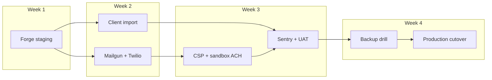

# Production readiness roadmap

Path from current codebase to **100% production-ready** for the first client VPS (Forge, single-tenant).

**Last updated:** 2026-06-01 · **Tests:** 385 Pest · 68 Vitest · 10 Playwright

**Single source of truth** — update this file when phases complete. Parity IDs: [parity-checklist.md](./parity-checklist.md).

---

## Progress dashboard

| Metric | Value |
| --- | --- |
| **Overall production readiness** | **~55%** |
| Phase 0 — Staging ship (ops) | **~25%** (runbook + deploy script + staging checks; VPS not provisioned) |
| Phase 1 — Staff UX | **100%** — complete |
| Phase 2 — Comms hardening | **~45%** (code done; Mailgun/Twilio prod creds pending) |
| Phase 3 — Financial workflows | **~60%** (UI + closings; sandbox verify + reconciliation open) |
| Phase 4 — Data / import | **0%** (blocked on client dump + staging) |
| Phase 5 — Quality / observability | **~67%** (tests + E2E; Sentry + VPS logging pending) |
| Phase 6 — Security / compliance | **100%** — local code complete; live-money verify at deploy |

### How overall % is calculated

| Phase | Weight | Complete | Contribution |
| --- | ---: | ---: | ---: |
| 0 Staging ship | 25% | 25% | 6.3% |
| 1 Staff UX | 20% | 100% | 20.0% |
| 2 Notifications / comms | 15% | 45% | 6.8% |
| 3 Financial workflows | 10% | 60% | 6.0% |
| 4 Data / import quality | 10% | 0% | 0% |
| 5 Quality / observability | 10% | 67% | 6.7% |
| 6 Security / compliance | 10% | 100% | 10.0% |
| **Total** | **100%** | | **~55%** |

### Production exit checklist (must all be ☑ for 100%)

| # | Gate | Status |
| --- | --- | --- |
| 1 | Staging VPS provisioned; `mvp:staging-check` green | ☐ |
| 2 | Phase 1 staff UX exit criteria met | ☑ |
| 3 | Mailgun (or provider) domain verified; test send/receive | ☐ |
| 4 | Queue worker + failed-job monitoring on staging/prod | ☐ |
| 5 | Demo credentials removed or rotated on staging/prod | ☐ |
| 6 | DB backup restore tested once | ☐ |
| 7 | Runbook + on-call path documented | ☑ |

**Exit checklist: 2 / 7 (29%)**

---

## What's blocking production

- No staging VPS exercised end-to-end
- Client data import not run on real dump (mapping triage done locally — [LEGACY_MAPPING_GAPS.md](./LEGACY_MAPPING_GAPS.md))
- Mail/SMS provider credentials not configured on staging
- Dwolla/Plaid sandbox flows not browser-verified; CSP not enforced on staging
- Sentry + structured VPS logging not configured
- Live-money verification + pentest not done ([SECURITY_AUDIT.md](./SECURITY_AUDIT.md))

---

## Phase 0 — Staging ship (ops) · 25%

**Goal:** One real client stack on Forge passing smoke tests.

**Repo ready:** [`backend/.env.staging.example`](../backend/.env.staging.example), [`scripts/forge-deploy.sh`](../scripts/forge-deploy.sh), extended `mvp:staging-check`.

| # | Task | Owner | Status |
| --- | --- | --- | --- |
| 0.1 | Provision Forge server (Ubuntu 24.04, PHP 8.4, Postgres 17) | Ops | ☐ |
| 0.2 | Create site; TLS; env from `.env.staging.example` | Ops | ☐ |
| 0.3 | Wire `bash scripts/forge-deploy.sh` in Forge deployment | Ops | ☑ Script in repo |
| 0.4 | Queue worker + scheduler (cron) | Ops | ☐ |
| 0.5 | Forge daily DB backup | Ops | ☐ |
| 0.6 | `mvp:staging-check` green (fix FAIL rows) | Eng | ☐ |
| 0.7 | Manual smoke: login, grid, lead detail, FDD, composer, widget | Eng | ☐ |
| 0.8 | Remove/rotate `@fil.test` demo users | Ops | ☐ |
| 0.9 | Import client SQL dump (Phase 4) | Ops + Eng | ☐ |

**Runbook:** [MVP_DEPLOY.md](./MVP_DEPLOY.md) · **Operator checklist:** [FORGE_STAGING_CHECKLIST.md](./FORGE_STAGING_CHECKLIST.md)

**Staging env that FAILs `mvp:staging-check` until set:** `MAIL_MAILER=mailgun`, `MAILGUN_WEBHOOK_SIGNING_KEY`, `DWOLLA_WEBHOOK_SECRET`, `FIL_CSP_ENABLED=true` (start `FIL_CSP_REPORT_ONLY=true`), embed keys + origins, built SPA/widget (deploy script handles).

---

## Phase 1 — Staff UX · 100% ✓

Complete. Grids, detail pages, FDD (single + bulk), SMS/email composer, activity timeline (Phases A–C), slide-over panel, contact custom fields, server-driven nav. See [parity-checklist.md](./parity-checklist.md) P-020+.

---

## Phase 2 — Notifications & comms · 45%

**Goal:** Reliable outbound/inbound mail and SMS in production. **Starts after:** Phase 0.7 smoke.

| # | Task | Status |
| --- | --- | --- |
| 2.1 | Mailgun domain + DNS verified | ☐ |
| 2.2 | Twilio prod credentials (if SMS) | ☐ |
| 2.3 | Test send from composer + drip on staging | ☐ |

**Code complete:** inbound webhooks, bounce/suppression, retry job (`SendStaffCommunicationJob`).

---

## Phase 3 — Financial workflows · 60%

| # | Task | Status |
| --- | --- | --- |
| 3.1 | Closing workflow + fee line items | ☑ |
| 3.2 | CSV export (closings + activity) | ☑ |
| 3.3 | Dwolla enrollment UI | ☑ UI shipped — sandbox browser verify pending |
| 3.4 | Admin reconciliation view | ☐ |

**Priority:** After Phase 2 if client needs fees at launch; otherwise post-v1.

---

## Phase 4 — Data & import · 0%

| # | Task | Status |
| --- | --- | --- |
| 4.1 | Obtain latest client DB dump | ☐ |
| 4.2 | Run import pipeline on staging | ☐ — [LEGACY_IMPORT_DRY_RUN.md](./LEGACY_IMPORT_DRY_RUN.md) |
| 4.3 | Parity report + UI spot-check | ☐ |
| 4.4 | Client sign-off | ☐ |

PrimeIV dump mapping triage: **0 unmapped** store/lead keys (local).

---

## Phase 5 — Quality & observability · 67%

| # | Task | Status |
| --- | --- | --- |
| 5.1 | Pest + Vitest + Playwright E2E | ☑ 385 / 68 / 10 |
| 5.2 | `mvp:staging-check` | ☑ |
| 5.3 | Sentry backend + frontend | ☐ |
| 5.4 | Structured logging + log rotation on VPS | ☐ |

---

## Phase 6 — Security & compliance · 100% ✓

Local SEC-001–025 remediation verified — [status table](./SECURITY_AUDIT.md#remediation-status-verified-2026-05-31). Draft policies: [SECRETS_ROTATION.md](./SECRETS_ROTATION.md), [PII_RETENTION.md](./PII_RETENTION.md). Live-money verification + pentest blocked on external creds.

---

## Phase 7 — Performance · as needed

Grid pagination server-side; index review after Phase 4 import. No Redis/ES until proven necessary ([DEPLOYMENT.md](./DEPLOYMENT.md)).

---

## Phase 8 — Post-v1 · out of scope

Marketing automation, advanced reporting, multi-brand — only if client requests after v1.

---

## Recommended sequence (next 30 days)

### Week 1 — Forge staging (Phase 0)

Follow [FORGE_STAGING_CHECKLIST.md](./FORGE_STAGING_CHECKLIST.md): VPS → env → deploy → worker/cron → `mvp:staging-check` → manual smoke → remove demo users.

### Week 2 — Data + comms (Phases 4 + 2)

Import client dump on staging; Mailgun sandbox + test composer/drip; inbound webhook.

### Week 3 — Hardening (Phases 2b + 5)

Plaid/Dwolla sandbox → CSP live validation → enforce; Sentry DSN; extend E2E if needed.

### Week 4 — Cutover prep

Client UAT; backup/restore drill; production deploy + 48h queue monitor.

---

## Quick links

- [Docs index](./README.md)
- [Deploy runbook](./MVP_DEPLOY.md)
- [Forge operator checklist](./FORGE_STAGING_CHECKLIST.md)
- [Local blocked items](./NEXT_LOCAL_WORK.md)
- [Stack versions](./STACK.md)
